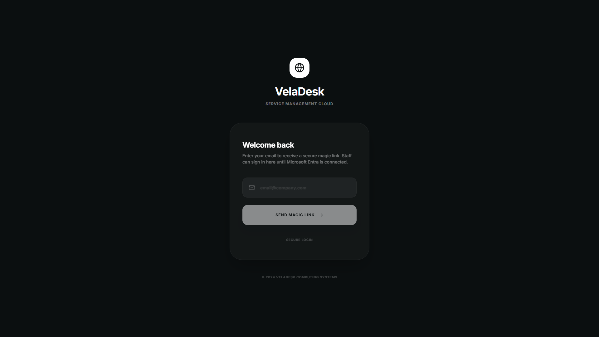
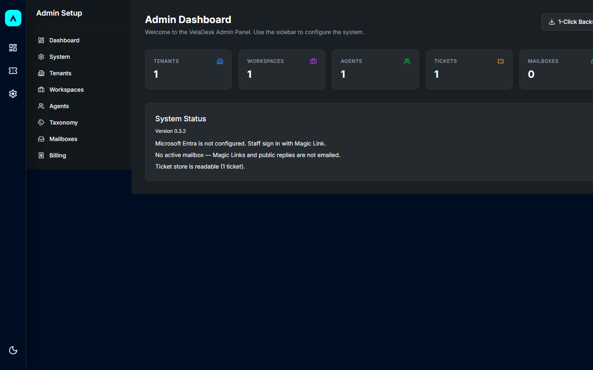
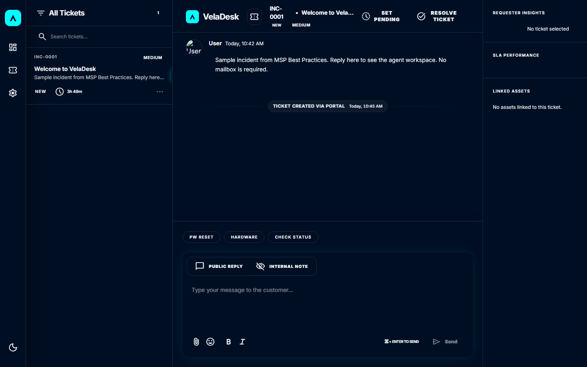
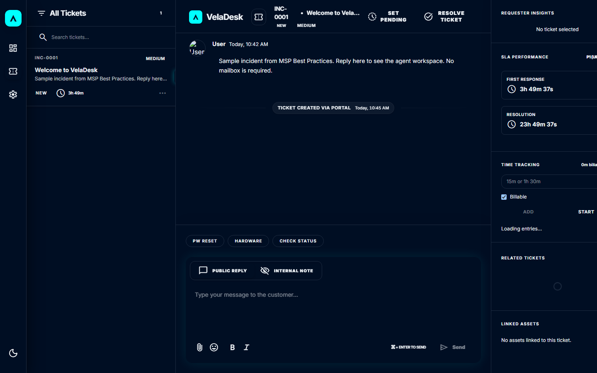

# VelaDesk

Lightweight, multi-tenant CSM/ITSM for small IT teams and MSPs. Runs on a Raspberry Pi or a small Windows Server. Microsoft 365 is the primary mail channel.

**Version:** 0.3.6  
**License:** [MIT](./LICENSE)

## What it is

A helpdesk that you host yourself: ticket queue, customer portal (Magic Link), shared-mailbox ingest via Microsoft Graph, MSP tenants, SLAs, time tracking, and inbound RMM webhooks.

It is not Zammad or GLPI. The point is a first workday on modest hardware, not a full ITIL suite.

## Self-hosted ITSM under 1 GB RAM

Zammad and GLPI are complete helpdesks. They expect a database server, background workers, and commonly 2–4 GB RAM before the queue is useful. VelaDesk is the other end of that trade: one Docker container, SQLite on disk, about 512 MB for the app.

Use it when a small IT team or MSP wants tickets, a Magic Link portal, and optional Microsoft 365 mail on a Raspberry Pi or a small Windows box. Skip it if you need a CMDB, a software catalog, or a full ITIL suite.

| | VelaDesk | Typical self-hosted ITSM |
| --- | --- | --- |
| Host | Raspberry Pi or small Windows Server | Dedicated VM, 2–4 GB RAM common |
| Data | SQLite in the container volume | Postgres or MySQL beside the app |
| First login | Magic Link; Microsoft Entra optional | Local users or SSO first |
| Mail | Microsoft Graph when a mailbox exists | IMAP/SMTP or a separate mail stack |

## Für Systemhäuser (DACH)

VelaDesk ist für kleine IT und MSPs, die Tickets selbst hosten wollen — nicht für US-SaaS-Vergleiche.

- Läuft auf einem Raspberry Pi oder einem kleinen Windows-Server, unter 1 GB RAM.
- Kundenportal und Ausgangsmails tragen den Namen, die Sprache und das Logo des Mandanten.
- Microsoft 365 nur, wenn ein Postfach angeschlossen ist. Ohne Postfach kein vorgetäuschter Versand.
- First-Run per Magic Link. Entra SSO ist optional, nicht die Voraussetzung.

## Demo

[90-second walkthrough](public/demo/veladesk-90s.mp4): install on a Pi, open the public home page, sign in with a Magic Link, then open the seeded ticket queue.

## Screenshots

| Login | Admin |
| --- | --- |
|  |  |

| Queue | Ticket |
| --- | --- |
|  |  |

## Install

### Linux / Raspberry Pi

```bash
curl -fsSL https://raw.githubusercontent.com/unpaved028/VelaDesk/refs/heads/master/install.sh | sudo bash
```

The app listens on `http://<host>:3000`. Config lives in `/opt/VelaDesk/`. Data is SQLite under `./data`.

### Windows Server

PowerShell as Administrator:

```powershell
irm https://raw.githubusercontent.com/unpaved028/VelaDesk/refs/heads/master/install.ps1 | iex
```

Then open `http://localhost:3000`. Config lives in `C:\VelaDesk\`.

## First run

1. Open the setup wizard (`/setup` until an admin exists).
2. Create the first SUPER_ADMIN.
3. Choose **MSP Best Practices** to seed Hardware/Software/Netzwerk/Account, P1/P2/Standard SLAs, and three sample tickets — or **Lean Start** for an empty system.
4. Open `/` (public demo) and sign in at `/login` with a Magic Link. Microsoft Entra is not required.

Until Microsoft Entra is connected, staff use the same Magic Link as the portal. If no mailbox is configured, the login page shows a **copyable** link. Nothing is emailed, and the UI does not claim otherwise.

## Microsoft 365

Connect a shared mailbox under **Admin → Mailboxes**. Public replies and Magic Link mail go out through Graph only when that mailbox is active. Without it, replies are saved in the ticket and not sent.

## Updates

Images publish to `ghcr.io/unpaved028/veladesk:latest`. On the host:

```bash
cd /opt/VelaDesk
docker compose pull veladesk-app
docker compose up -d --force-recreate veladesk-app
```

## Requirements

- Docker and Docker Compose
- About 512 MB RAM is enough for the app container
- Optional: Microsoft 365 app registration with application permissions `Mail.ReadWrite`, `Mail.Send`, `Files.ReadWrite.All`, and `Sites.ReadWrite.All` (`public/scripts/setup-m365.ps1`). Offsite backup uses that app to write a SQLite snapshot to OneDrive or a SharePoint document library. Shared mailboxes usually have no OneDrive — prefer a SharePoint site.

Do not deploy this as a Vercel serverless app. The runtime is one container plus SQLite.
